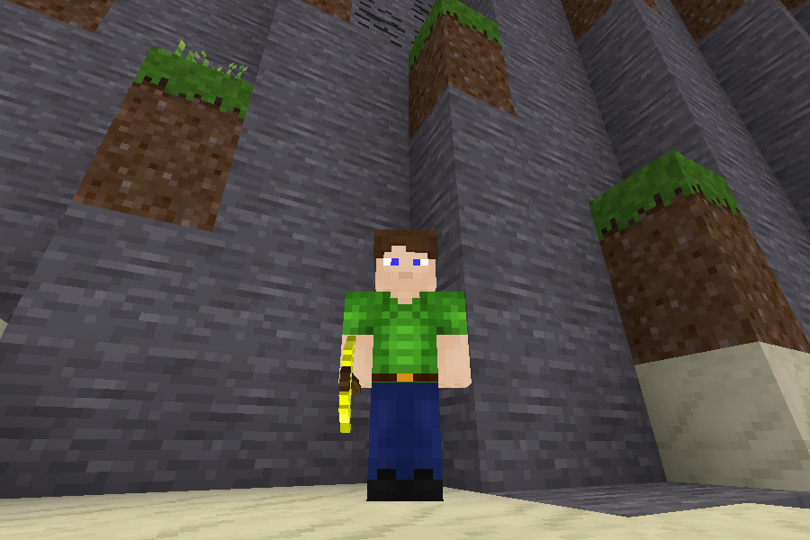

3d wielded items [wield3d]
==========================

This is a mod for Luanti/Minetest which makes hand wielded items visible
to other players.

For engine version: 5.0.0 or later.

Settings: see [settingtypes.txt](settingtypes.txt) (or in the main menu)

### Game Compatibility

wield3d is generic and supports all games. However, certain items might not be
shown perfectly, thus this mod includes specific improvements for the following games:

 * Minetest Game

### Known Issues

Items occasionally disappear when viewing in 3rd person. This is a minetest engine bug and not the fault of the mod, turning 3rd person off then back on restores the view.

Wield item switches direction at certain animation key-frames. I have yet to identify the true cause of this issue but a specially adapted version of the player model can be found [here](https://github.com/stujones11/minetest-models/tree/master/character/sam_viewer) that attempts to work around the problem.
